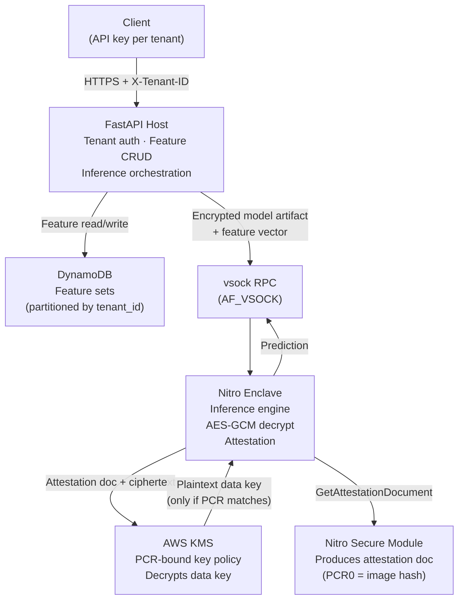

# Confidential ML Feature Store

> A multi-tenant ML feature store that isolates inference workloads inside AWS Nitro Enclaves with attestation-gated KMS key release. Model weights never touch the host OS.

---

## The Problem

Standard ML inference APIs run model weights on the host OS — a compromised root process, a rogue admin, or a noisy-neighbour tenant can read model parameters, intercept feature data, or exfiltrate decryption keys straight out of memory. For regulated industries and SaaS platforms serving multiple tenants this is not acceptable.

This project solves three things: it moves decryption and inference inside a hardware memory enclave the host OS cannot inspect, it binds KMS key release to a cryptographic measurement of the enclave image so a modified binary gets nothing, and it isolates every tenant's feature data and models by partition key and encryption context so one tenant's keys can never decrypt another's ciphertext.

---

## Architecture



**Local development** runs without hardware via `USE_MOCK_ENCLAVE=true`. The `MockEnclaveClient` executes the same serialisation and orchestration path so integration tests cover everything except the attestation step.

---

## Key Technical Decisions

- **Nitro Enclaves over SGX** — Nitro is a first-class AWS primitive with native KMS attestation support, no driver installation, and PCR values that deterministically match the EIF image hash. SGX requires attestation infrastructure you build and maintain yourself.
- **vsock RPC over network sockets** — `AF_VSOCK` is the only channel between host and enclave. No network stack, no shared filesystem, no shared memory. The host sends a 4-byte length-prefixed JSON frame; the enclave returns a JSON response. Nothing else crosses the boundary.
- **Attestation-gated KMS** — The KMS key policy contains a `kms:RecipientAttestation:PCR0` condition. The enclave requests decryption with its attestation document attached. If the enclave image has been modified, PCR0 changes and KMS returns access denied — the host cannot override this.
- **Envelope encryption per tenant** — Each model artifact is encrypted with a unique AES-256-GCM data key. That data key is KMS-encrypted with `EncryptionContext: {tenant_id: <id>}`. A ciphertext from tenant A cannot be decrypted under tenant B's context.
- **DynamoDB for feature storage** — Partition key (`tenant_id`) + sort key (`resource_id`) gives tenant isolation at the storage layer with no joins and predictable single-digit millisecond latency.

---

## What's Implemented

- ✅ Tenant-authenticated FastAPI REST API (CRUD for feature sets)
- ✅ DynamoDB storage with `tenant_id` partitioning and versioning
- ✅ vsock RPC server inside the enclave (length-prefixed JSON frames, thread-pooled)
- ✅ AES-256-GCM envelope encryption with tenant-bound additional authenticated data
- ✅ KMS attestation-gated data key release (`EnclaveKMSClient`)
- ✅ TTL-cached decrypted keys inside enclave memory — never written to host
- ✅ Mock enclave mode for local development without Nitro hardware
- ✅ Model training + encryption script (`scripts/train_model.py`)
- ✅ Integration tests: tenant isolation, inference, enclave client, KMS attestation
- 🚧 Full PCR attestation certificate chain validation (currently relies on KMS policy enforcement)
- 🚧 Multi-region KMS replication
- 🚧 Rate limiting on inference endpoints

---

## Tech Stack

| Layer | Technology |
|---|---|
| API | Python 3.11 · FastAPI · Pydantic v2 · uvicorn |
| Storage | AWS DynamoDB (local: DynamoDB Local via Docker) |
| Enclave | AWS Nitro Enclaves · Nitro CLI · AF_VSOCK |
| Encryption | AWS KMS · AES-256-GCM (`cryptography` library) |
| ML | scikit-learn · joblib |
| Testing | pytest · moto · httpx |
| Dev tooling | Docker Compose · Makefile · ruff · mypy |

---

## Local Development

```bash
# 1. Install dependencies
make install

# 2. Configure environment
cp .env.example .env
# Edit .env — set KMS_KEY_ID, AWS credentials, etc.

# 3. Start DynamoDB Local + API
make docker-up

# 4. Create table and seed a test tenant
make setup-dynamodb

# 5. Train and encrypt a sample model artifact
make train-model TENANT_ID=tenant-abc

# 6. Run the API in mock enclave mode
make run-local

# 7. Run tests
make test
```

The API is at `http://localhost:8000`. Interactive docs at `http://localhost:8000/docs`.

### Screenshots

**Docker Compose startup**


**Containers running in Docker Desktop**


**DynamoDB Local setup**


**Health check**


**Feature + inference curl requests**


**pytest results**


---

## Deployment (AWS)

```bash
# 1. Provision KMS key and DynamoDB table
make setup-kms
make setup-dynamodb

# 2. Build the Nitro Enclave Image File
make build-enclave

# 3. Start the enclave on an enclave-enabled EC2 instance
make run-enclave

# 4. Run the host API against the real enclave
USE_MOCK_ENCLAVE=false uvicorn feature_store.main:app
```

Full step-by-step including PCR-bound KMS key policy configuration: [`docs/SETUP_AWS.md`](docs/SETUP_AWS.md)

---

## Repository Layout

```
confidential-ml-feature-store/
├── feature_store/          # Host-side FastAPI application
│   ├── main.py             # App factory, lifespan, middleware wiring
│   ├── config.py           # Pydantic-settings configuration
│   ├── middleware/         # Tenant authentication (X-Tenant-ID + X-API-Key)
│   ├── models/             # Pydantic request/response schemas
│   ├── routers/            # Feature CRUD, inference, health endpoints
│   ├── services/           # DynamoDB, enclave client, feature, KMS services
│   └── utils/              # Structured logging, exception handlers
├── enclave/                # Nitro Enclave process (runs inside EIF)
│   ├── server.py           # vsock RPC server (threaded, length-prefixed frames)
│   ├── inference_engine.py # Model loading, AES-GCM decrypt, prediction
│   ├── attestation.py      # CBOR attestation document parsing
│   ├── kms_client.py       # Attestation-aware KMS decrypt over vsock proxy
│   └── Dockerfile.enclave  # Enclave image build
├── scripts/
│   ├── train_model.py      # Train + envelope-encrypt a scikit-learn artifact
│   ├── setup_dynamodb.sh   # Create table and seed tenant record
│   ├── setup_kms.sh        # Provision KMS key with PCR-bound policy
│   ├── build_enclave.sh    # Build and validate the EIF
│   └── run_enclave.sh      # Launch enclave on Nitro-capable EC2
├── tests/                  # pytest integration tests (uses moto for AWS mocks)
├── docs/
│   ├── ARCHITECTURE.md     # Component diagram and data flow
│   ├── SECURITY_MODEL.md   # Threat model and trust boundaries
│   └── SETUP_AWS.md        # Full AWS deployment walkthrough
├── docker-compose.yml      # DynamoDB Local + feature store for local dev
├── Makefile                # install, test, lint, run, deploy targets
└── pyproject.toml          # Pinned dependencies
```

---

## What I Learned

- **Attestation documents are CBOR, not JSON.** The Nitro Secure Module returns a COSE_Sign1-wrapped CBOR blob. Parsing it in pure Python without a native library required implementing a subset of CBOR decoding by hand, which surfaced edge cases in the indefinite-length encoding spec.
- **KMS key policies bind to PCR values, not IAM roles.** The standard mental model of "IAM controls everything" breaks here — you write a condition key (`kms:RecipientAttestation:PCR0`) into the key policy and KMS enforces it at the hardware level before any IAM evaluation.
- **vsock has no DNS, no TLS, no framing.** You get a raw byte stream. Building reliable request/response framing over vsock required length-prefixed frames with explicit error codes to avoid silent truncation on the enclave side.
- **Mock mode is load-bearing, not a crutch.** The `MockEnclaveClient` runs the same serialisation path as real vsock RPC. When mock tests pass but the real enclave fails, the bug is isolated to the attestation or KMS path — the only part that genuinely can't be mocked — which dramatically narrows the debugging surface.
- **DynamoDB `ConditionExpression` is the last line of tenant isolation.** Middleware checks are necessary but not sufficient — a bug in the auth layer could bypass them. Writing `ConditionExpression: tenant_id = :caller` on every write means the database rejects cross-tenant mutations even if the application layer fails.

---

## License

MIT — see [LICENSE](LICENSE).
