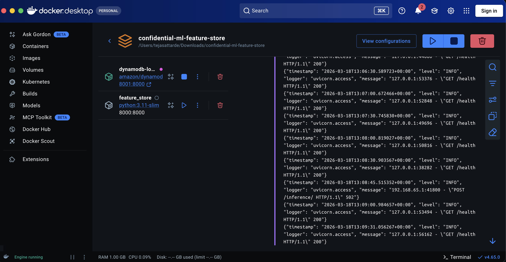
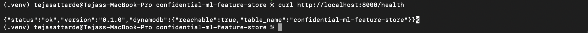
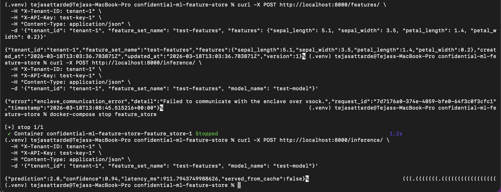
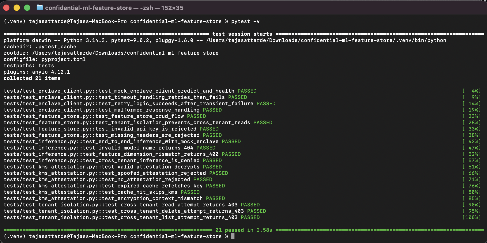
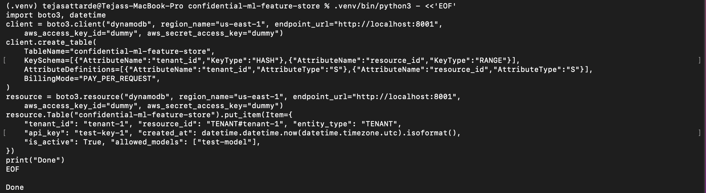
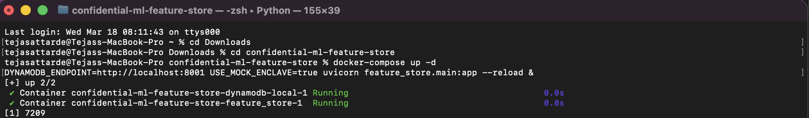

# Confidential ML Feature Store with Hardware-Isolated Inference


A tenant-isolated FastAPI feature store backed by DynamoDB with an enclave-compatible inference path, KMS attestation plumbing, and a local `USE_MOCK_ENCLAVE=true` development mode.

## Overview

This repository contains a working multi-tenant feature store and inference service with the following current capabilities:

- authenticated tenant-scoped feature CRUD
- DynamoDB storage with `tenant_id` / `resource_id` keying
- host-side inference orchestration through `POST /inference/`
- local development inference through `feature_store/services/enclave_client.py::MockEnclaveClient`
- real enclave transport through `feature_store/services/enclave_client.py::EnclaveClient`
- in-enclave model loading and prediction through `enclave/inference_engine.py::InferenceEngine`
- KMS integration for tenant-bound encryption context and attestation-shaped decrypt requests
- sample encrypted model artifacts under `artifacts/tenant-1/test-model/`

## Architecture

```mermaid
flowchart LR
    Client[HTTP Client]
    App["feature_store/main.py\ncreate_app()"]
    Auth["feature_store/middleware/tenant_auth.py\nget_current_tenant()"]
    Features["feature_store/routers/features.py"]
    Inference["feature_store/routers/inference.py"]
    FeatureService["feature_store/services/feature_service.py\nFeatureService"]
    DynamoService["feature_store/services/dynamo_service.py\nDynamoDBService"]
    Resolver["feature_store/services/enclave_client.py\nget_enclave_client()"]
    HostClient["feature_store/services/enclave_client.py\nEnclaveClient"]
    MockClient["feature_store/services/enclave_client.py\nMockEnclaveClient"]
    ArtifactLoader["feature_store/routers/inference.py\n_load_model_artifacts()"]
    ModelStore[(MODEL_STORAGE_DIR)]
    DynamoDB[(DynamoDB)]
    Server["enclave/server.py\nVsockRPCServer"]
    Engine["enclave/inference_engine.py\nInferenceEngine"]
    EnclaveKMS["enclave/kms_client.py\nEnclaveKMSClient"]
    Attestation["enclave/attestation.py\nget_attestation_document()"]
    KMS[(AWS KMS)]

    Client --> App
    App --> Auth
    Auth --> Features
    Auth --> Inference
    Features --> FeatureService --> DynamoService --> DynamoDB
    Inference --> FeatureService
    Inference --> ArtifactLoader --> ModelStore
    Inference --> Resolver
    Resolver -->|USE_MOCK_ENCLAVE=true| MockClient
    Resolver -->|USE_MOCK_ENCLAVE=false| HostClient
    MockClient --> Engine
    HostClient -->|AF_VSOCK JSON RPC| Server --> Engine --> EnclaveKMS --> Attestation
    EnclaveKMS --> KMS
```



For a deeper architectural walkthrough, see [docs/ARCHITECTURE.md](docs/ARCHITECTURE.md).

## Demo

### Docker running



### Health check



### Feature creation



### Inference


### Test results



### Additional local setup screenshots





## Quick Start

This quick start uses the current code exactly as it exists today:

- `docker-compose.yml` for DynamoDB Local
- `USE_MOCK_ENCLAVE=true` so inference works without a real enclave
- the bundled encrypted sample model at `artifacts/tenant-1/test-model/`

### 1. Install dependencies

```bash
make install
```

### 2. Copy the environment file

```bash
cp .env.example .env
```

Recommended local `.env` values:

```dotenv
AWS_REGION=us-east-1
DYNAMODB_TABLE_NAME=confidential-ml-feature-store
DYNAMODB_ENDPOINT=http://localhost:8001
KMS_KEY_ID=local-placeholder-kms-key
ENCLAVE_CID=16
ENCLAVE_PORT=5005
LOG_LEVEL=INFO
USE_MOCK_ENCLAVE=true
```

### 3. Start DynamoDB Local

Use the existing Compose file to start the DynamoDB service:

```bash
docker compose up -d dynamodb-local
```

### 4. Create the DynamoDB table

For local DynamoDB, provide dummy AWS credentials and point the setup script at the mapped port:

```bash
AWS_ACCESS_KEY_ID=dummy \
AWS_SECRET_ACCESS_KEY=dummy \
AWS_REGION=us-east-1 \
DYNAMODB_TABLE_NAME=confidential-ml-feature-store \
DYNAMODB_ENDPOINT=http://localhost:8001 \
./scripts/setup_dynamodb.sh
```

### 5. Seed a tenant record

The authenticated routes require a tenant item in DynamoDB.

```bash
python - <<'PY'
from datetime import datetime, timezone
import boto3

table = boto3.resource(
    "dynamodb",
    region_name="us-east-1",
    endpoint_url="http://localhost:8001",
    aws_access_key_id="dummy",
    aws_secret_access_key="dummy",
).Table("confidential-ml-feature-store")

table.put_item(
    Item={
        "tenant_id": "tenant-1",
        "resource_id": "TENANT#tenant-1",
        "entity_type": "TENANT",
        "api_key": "test-key-1",
        "created_at": datetime.now(timezone.utc).isoformat(),
        "is_active": True,
        "allowed_models": ["test-model"],
    }
)
print("Seeded tenant-1")
PY
```

### 6. Start the FastAPI application in mock-enclave mode

Use the new Makefile target that matches the current local-development pattern:

```bash
make run-dev-mock
```

This expands to:

```bash
DYNAMODB_ENDPOINT=http://localhost:8001 USE_MOCK_ENCLAVE=true uvicorn feature_store.main:app --host 0.0.0.0 --port 8000 --reload
```

### 7. Check service health

```bash
curl http://localhost:8000/health
```

Expected response:

```json
{
  "status": "ok",
  "version": "0.1.0",
  "dynamodb": {
    "reachable": true,
    "table_name": "confidential-ml-feature-store"
  }
}
```

### 8. Create a feature set

```bash
curl -X POST http://localhost:8000/features/ \
  -H "X-Tenant-ID: tenant-1" \
  -H "X-API-Key: test-key-1" \
  -H "Content-Type: application/json" \
  -d '{
    "tenant_id": "tenant-1",
    "feature_set_name": "test-features",
    "features": {
      "sepal_length": 5.1,
      "sepal_width": 3.5,
      "petal_length": 1.4,
      "petal_width": 0.2
    }
  }'
```

Expected response shape:

```json
{
  "tenant_id": "tenant-1",
  "feature_set_name": "test-features",
  "features": {
    "sepal_length": 5.1,
    "sepal_width": 3.5,
    "petal_length": 1.4,
    "petal_width": 0.2
  },
  "created_at": "2026-03-18T13:03:36.783871Z",
  "updated_at": "2026-03-18T13:03:36.783871Z",
  "version": 1
}
```

### 9. Run inference

The repository already contains a sample encrypted model bundle for:

- tenant: `tenant-1`
- model: `test-model`

Call the current inference endpoint:

```bash
curl -X POST http://localhost:8000/inference/ \
  -H "X-Tenant-ID: tenant-1" \
  -H "X-API-Key: test-key-1" \
  -H "Content-Type: application/json" \
  -d '{
    "tenant_id": "tenant-1",
    "feature_set_name": "test-features",
    "model_name": "test-model"
  }'
```

Expected response shape:

```json
{
  "prediction": 2.0,
  "confidence": 0.94,
  "latency_ms": 911.79,
  "served_from_cache": false
}
```

### 10. List available and loaded models

```bash
curl http://localhost:8000/inference/models \
  -H "X-Tenant-ID: tenant-1" \
  -H "X-API-Key: test-key-1"
```

Expected response:

```json
{
  "available_models": ["test-model"],
  "loaded_models": ["test-model"]
}
```

## API Reference

| Method | Path | Auth | Request schema | Response schema |
| --- | --- | --- | --- | --- |
| `GET` | `/health` | none | none | `HealthCheckResponse` |
| `POST` | `/features/` | `X-Tenant-ID`, `X-API-Key` | `FeatureSetCreate` | `FeatureSetResponse` |
| `GET` | `/features/` | `X-Tenant-ID`, `X-API-Key` | query: `tenant_id` optional | `list[FeatureSetResponse]` |
| `GET` | `/features/{feature_set_name}` | `X-Tenant-ID`, `X-API-Key` | path: `feature_set_name`, query: `tenant_id` optional | `FeatureSetResponse` |
| `DELETE` | `/features/{feature_set_name}` | `X-Tenant-ID`, `X-API-Key` | path: `feature_set_name`, query: `tenant_id` optional | `204 No Content` |
| `POST` | `/inference/` | `X-Tenant-ID`, `X-API-Key` | `InferenceRequest` | `InferenceResponse` |
| `GET` | `/inference/models` | `X-Tenant-ID`, `X-API-Key` | none | `{"available_models": list[str], "loaded_models": list[str]}` |

### Request and response schemas

#### `FeatureSetCreate`

```json
{
  "tenant_id": "string",
  "feature_set_name": "string",
  "features": {
    "feature_name": 0.123
  }
}
```

#### `FeatureSetResponse`

```json
{
  "tenant_id": "string",
  "feature_set_name": "string",
  "features": {
    "feature_name": 0.123
  },
  "created_at": "datetime",
  "updated_at": "datetime",
  "version": 1
}
```

#### `InferenceRequest`

```json
{
  "tenant_id": "string",
  "feature_set_name": "string",
  "model_name": "string"
}
```

#### `InferenceResponse`

```json
{
  "prediction": 0.0,
  "confidence": 0.95,
  "latency_ms": 12.3,
  "served_from_cache": false
}
```

#### Error response envelope

```json
{
  "error": "string",
  "detail": "string",
  "request_id": "string | null",
  "timestamp": "iso8601 datetime"
}
```

## Performance Notes

The current implementation exposes several useful performance properties:

- `feature_store/routers/inference.py::run_inference()` logs:
  - `dynamodb_ms`
  - `enclave_round_trip_ms`
  - `enclave_compute_ms`
  - `total_ms`
- `enclave/inference_engine.py::InferenceEngine` caches loaded models in memory with LRU eviction
- `enclave/kms_client.py::EnclaveKMSClient` caches decrypted keys with a TTL
- the first request for a model is slower because it loads, decrypts, and deserializes the model
- subsequent requests may return `served_from_cache=true`

## Security

This project is designed around tenant isolation and confidential inference primitives.

Current security controls include:

- tenant authentication through `X-Tenant-ID` and `X-API-Key`
- tenant ownership enforcement in `feature_store/services/feature_service.py::FeatureService`
- DynamoDB partitioning by `tenant_id`
- model artifact encryption and KMS encryption context
- Nitro Enclave attestation helpers for PCR-bound KMS decrypt policies

See [docs/SECURITY_MODEL.md](docs/SECURITY_MODEL.md) for the full threat model and design assumptions.

## AWS Deployment

For step-by-step deployment instructions, see [docs/SETUP_AWS.md](docs/SETUP_AWS.md).

That guide covers:

- launching a Nitro-enabled EC2 parent instance
- installing the Nitro Enclaves CLI
- configuring the allocator
- building the EIF with `scripts/build_enclave.sh`
- creating the PCR-bound KMS key with `scripts/setup_kms.sh`
- running the enclave with `scripts/run_enclave.sh`
- training and deploying models with `scripts/train_model.py`

## Repository Layout

```text
confidential-ml-feature-store/
├── README.md
├── CONTRIBUTING.md
├── LICENSE
├── .env.example
├── docker-compose.yml
├── Makefile
├── pyproject.toml
├── requirements.txt
├── docs/
│   ├── ARCHITECTURE.md
│   ├── SECURITY_MODEL.md
│   ├── SETUP_AWS.md
│   └── screenshots/
│       └── README.md
├── feature_store/
│   ├── main.py
│   ├── config.py
│   ├── models/
│   ├── routers/
│   ├── services/
│   ├── middleware/
│   └── utils/
├── enclave/
│   ├── server.py
│   ├── inference_engine.py
│   ├── kms_client.py
│   ├── attestation.py
│   └── Dockerfile.enclave
├── scripts/
│   ├── build_enclave.sh
│   ├── run_enclave.sh
│   ├── setup_dynamodb.sh
│   ├── setup_kms.sh
│   └── train_model.py
└── tests/
    ├── conftest.py
    ├── test_feature_store.py
    ├── test_inference.py
    ├── test_enclave_client.py
    ├── test_kms_attestation.py
    └── test_tenant_isolation.py
```

## Built With

- [FastAPI](https://fastapi.tiangolo.com/) for the HTTP API
- `boto3` for DynamoDB and KMS integrations
- `pydantic` and `pydantic-settings` for validation and settings
- `scikit-learn` and `joblib` for model serialization and inference
- `cryptography` for AES-GCM envelope encryption
- AWS Nitro Enclaves for the confidential inference target architecture
- `pytest` and `moto` for local, AWS-free test execution

## License

This repository is licensed under the MIT License. See [LICENSE](LICENSE).
