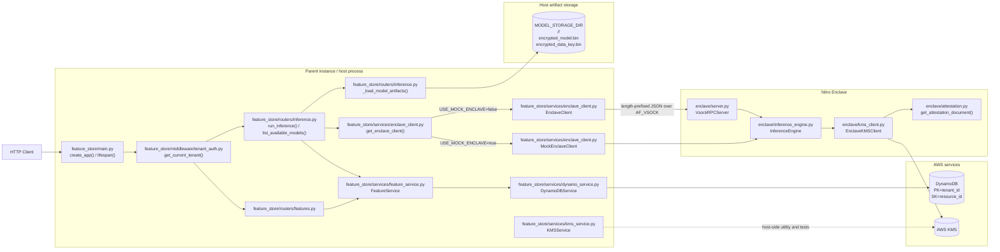

# Architecture

This document describes the current implementation of the Confidential ML Feature Store as it exists in the codebase.

## System Overview

The system has two execution modes:

1. **Local development mode**
   - `feature_store/services/enclave_client.py::get_enclave_client()` returns `MockEnclaveClient` when `USE_MOCK_ENCLAVE=true`
   - inference runs in-process through `enclave/inference_engine.py::InferenceEngine`

2. **Nitro Enclave mode**
   - `feature_store/services/enclave_client.py::get_enclave_client()` returns `EnclaveClient`
   - the host sends a length-prefixed JSON request over vsock
   - `enclave/server.py::VsockRPCServer` handles the request inside the enclave
   - `enclave/inference_engine.py::InferenceEngine` loads encrypted model artifacts into enclave memory
   - `enclave/kms_client.py::EnclaveKMSClient` unwraps model data keys through the host-side KMS proxy
   - `enclave/attestation.py::get_attestation_document()` provides attestation material for KMS recipient requests

The FastAPI application itself is created in `feature_store/main.py::create_app()` and uses a lifespan handler to initialize:

- `feature_store/services/dynamo_service.py::DynamoDBService`
- `feature_store/services/feature_service.py::FeatureService`

## Primary Components

| File path | Class / function | Responsibility |
| --- | --- | --- |
| `feature_store/main.py` | `create_app()` | Builds the FastAPI app, CORS config, request ID middleware, router registration, and exception handlers |
| `feature_store/main.py` | `lifespan()` | Creates `DynamoDBService` and `FeatureService` on application startup |
| `feature_store/middleware/tenant_auth.py` | `get_current_tenant()` | Authenticates `X-Tenant-ID` and `X-API-Key` against DynamoDB tenant records |
| `feature_store/routers/health.py` | `health()` | Returns service version and DynamoDB connectivity |
| `feature_store/routers/features.py` | `create_feature_set()` | Creates a tenant-owned feature set |
| `feature_store/routers/features.py` | `get_feature_set()` | Fetches a tenant-owned feature set |
| `feature_store/routers/features.py` | `list_feature_sets()` | Lists the tenant's feature sets |
| `feature_store/routers/features.py` | `delete_feature_set()` | Deletes a tenant-owned feature set |
| `feature_store/routers/inference.py` | `run_inference()` | Fetches features, loads model artifacts, calls the enclave client, and returns `InferenceResponse` |
| `feature_store/routers/inference.py` | `list_available_models()` | Lists artifact-backed models and currently loaded enclave models |
| `feature_store/routers/inference.py` | `_load_model_artifacts()` | Reads `encrypted_model.bin` and `encrypted_data_key.bin` from `MODEL_STORAGE_DIR` |
| `feature_store/services/feature_service.py` | `FeatureService` | Enforces tenant ownership and prepares deterministic feature vectors |
| `feature_store/services/dynamo_service.py` | `DynamoDBService` | Reads and writes tenant and feature-set records in DynamoDB |
| `feature_store/services/enclave_client.py` | `get_enclave_client()` | Chooses between `EnclaveClient` and `MockEnclaveClient` |
| `feature_store/services/enclave_client.py` | `EnclaveClient` | Sends length-prefixed JSON requests over AF_VSOCK with retries and connection pooling |
| `feature_store/services/enclave_client.py` | `MockEnclaveClient` | Mirrors the enclave interface locally for development and tests |
| `feature_store/services/kms_service.py` | `KMSService` | Host-side KMS helper for tenant-bound encryption, decryption, and attested request construction |
| `enclave/server.py` | `VsockRPCServer` | Length-prefixed JSON vsock RPC server inside the enclave |
| `enclave/inference_engine.py` | `InferenceEngine` | Loads encrypted model bundles, decrypts them, caches them, and serves predictions |
| `enclave/kms_client.py` | `EnclaveKMSClient` | Decrypts KMS-wrapped data keys through a host-side proxy and caches them with TTL |
| `enclave/attestation.py` | `get_attestation_document()` | Retrieves an NSM attestation document in production |
| `enclave/attestation.py` | `MockNSM` | Generates fake attestation documents for tests and local development |
| `scripts/train_model.py` | `main()` | Trains a sample model, envelope-encrypts it, and writes `encrypted_model.bin` plus `encrypted_data_key.bin` |

## DynamoDB Data Model

The actual table key schema used by both the code and the setup script is:

- partition key: `tenant_id`
- sort key: `resource_id`

### Tenant record layout

```json
{
  "tenant_id": "tenant-1",
  "resource_id": "TENANT#tenant-1",
  "entity_type": "TENANT",
  "api_key": "test-key-1",
  "created_at": "2026-03-18T13:00:00+00:00",
  "is_active": true,
  "allowed_models": ["test-model"]
}
```

### Feature set record layout

```json
{
  "tenant_id": "tenant-1",
  "resource_id": "FEATURE_SET#test-features",
  "entity_type": "FEATURE_SET",
  "feature_set_name": "test-features",
  "features": {
    "sepal_length": 5.1,
    "sepal_width": 3.5,
    "petal_length": 1.4,
    "petal_width": 0.2
  },
  "created_at": "2026-03-18T13:03:36.783871+00:00",
  "updated_at": "2026-03-18T13:03:36.783871+00:00",
  "version": 1
}
```

## Request Paths

### Feature CRUD path

1. `feature_store/main.py::create_app()` receives the HTTP request.
2. `feature_store/middleware/tenant_auth.py::get_current_tenant()` authenticates `X-Tenant-ID` and `X-API-Key`.
3. `feature_store/routers/features.py` forwards the request to `feature_store/services/feature_service.py::FeatureService`.
4. `FeatureService` validates tenant ownership.
5. `feature_store/services/dynamo_service.py::DynamoDBService` performs the DynamoDB operation.
6. A `FeatureSetResponse` or `204 No Content` is returned.

### Inference path in local mock mode

1. `feature_store/routers/inference.py::run_inference()` authenticates the tenant.
2. `FeatureService.prepare_feature_vector()` loads and sorts the feature values.
3. `_load_model_artifacts()` reads:
   - `MODEL_STORAGE_DIR/<tenant_id>/<model_name>/encrypted_model.bin`
   - `MODEL_STORAGE_DIR/<tenant_id>/<model_name>/encrypted_data_key.bin`
4. `get_enclave_client()` returns `MockEnclaveClient` when `USE_MOCK_ENCLAVE=true`.
5. `MockEnclaveClient` calls `enclave/inference_engine.py::InferenceEngine` directly.
6. The engine:
   - decrypts the wrapped data key through the local resolver
   - decrypts the AES-GCM model blob
   - deserializes the model with `joblib`
   - caches the model in memory
   - runs `predict()` and returns prediction metadata
7. `feature_store/routers/inference.py::run_inference()` returns `InferenceResponse`.

### Inference path in Nitro Enclave mode

1. `feature_store/routers/inference.py::run_inference()` authenticates the tenant.
2. `FeatureService.prepare_feature_vector()` loads the tenant-owned features.
3. `_load_model_artifacts()` reads the encrypted model files from `MODEL_STORAGE_DIR`.
4. `get_enclave_client()` returns `EnclaveClient` when `USE_MOCK_ENCLAVE=false`.
5. `EnclaveClient.predict()` opens or reuses a vsock connection and sends a length-prefixed JSON request to the enclave.
6. `enclave/server.py::VsockRPCServer` dispatches the `predict` action.
7. `enclave/inference_engine.py::InferenceEngine.load_model()` unwraps the encrypted data key using `enclave/kms_client.py::EnclaveKMSClient`.
8. `EnclaveKMSClient` requests an attestation document through `enclave/attestation.py::get_attestation_document()` and sends the KMS decrypt request through the host-side proxy.
9. `InferenceEngine` decrypts the model artifact, caches the loaded model, validates feature dimensions, and performs prediction.
10. `VsockRPCServer` returns a length-prefixed JSON response to the host.
11. `EnclaveClient` normalizes the response and `run_inference()` returns `InferenceResponse`.

## Security Boundaries

### Boundary 1: HTTP client to host API

The public API surface includes:

- `GET /health`
- `POST /features/`
- `GET /features/`
- `GET /features/{feature_set_name}`
- `DELETE /features/{feature_set_name}`
- `POST /inference/`
- `GET /inference/models`

The host must authenticate every non-health request through `get_current_tenant()`.

### Boundary 2: Host API to DynamoDB

Tenant ownership is enforced twice:

- at the API/service layer through `FeatureService`
- at the storage key level through `tenant_id` partitioning and `resource_id` prefixes

### Boundary 3: Host API to enclave

The host can relay inference requests over vsock, but in the real enclave path it should not decrypt protected model keys or inspect plaintext model bytes.

### Boundary 4: Enclave to KMS

`enclave/kms_client.py::EnclaveKMSClient` includes attestation data in KMS decrypt requests. The intent is that KMS releases model keys only to the expected enclave measurement.

### Boundary 5: Local mock mode

`MockEnclaveClient` is deliberately a development convenience. It mirrors the real client interface so the API and test suite can run without vsock or enclave hardware, but it is not a substitute for the real enclave trust boundary.

## Mermaid Diagram



## Notes on Model Storage

The current code expects encrypted model artifacts to be present under:

```text
MODEL_STORAGE_DIR/<tenant_id>/<model_name>/encrypted_model.bin
MODEL_STORAGE_DIR/<tenant_id>/<model_name>/encrypted_data_key.bin
```

That layout is produced by `scripts/train_model.py`.

## Notes on Local Development

The quickest way to exercise inference locally is:

1. run `docker compose up -d dynamodb-local`
2. seed a tenant record
3. start the FastAPI app with `USE_MOCK_ENCLAVE=true`
4. use the bundled sample model artifacts under `artifacts/tenant-1/test-model/`

This path exercises the same request/response schema and most of the same host-side orchestration code without requiring a real enclave.
