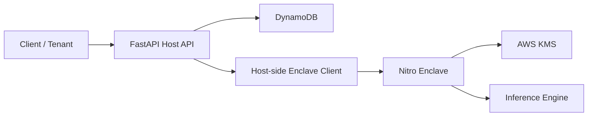

# Architecture

This document describes the target system architecture represented by the repository scaffold. The current codebase provides structure, configuration, scripts, and placeholder modules; the end-state flows described below are the intended design.

## High-Level Goal

Provide a feature store and inference service where:

- Tenants interact with a host-side FastAPI API
- Feature data is stored in DynamoDB
- Sensitive inference is executed inside an AWS Nitro Enclave
- AWS KMS cryptographic operations are bound to enclave attestation measurements
- The host communicates with the enclave over vsock rather than loading protected model material directly

## Architecture Diagram

The repository root includes a placeholder image:

- `../architecture.png`

You can replace it with a detailed diagram later.

## Component Overview

| Component | Responsibility |
| --- | --- |
| Client / Tenant | Sends feature CRUD and inference requests |
| FastAPI Host Service | Public API surface, request validation, orchestration, tenant context handling |
| Tenant Middleware | Extracts and validates tenant context for downstream routing |
| Feature Service | Orchestrates DynamoDB, KMS, and enclave interactions |
| DynamoDB | Stores tenant-scoped feature records |
| Enclave Client | Host-side vsock RPC boundary used to call enclave workloads |
| Nitro Enclave | Isolated runtime for sensitive inference tasks |
| Attestation Provider | Produces enclave identity material for trust establishment |
| AWS KMS | Releases cryptographic material only to attested enclave workloads |
| Inference Engine | Loads model artifacts and performs predictions inside the enclave |

## Logical Data Flow

### Feature ingestion flow

1. A client calls the host API with a tenant-scoped feature payload.
2. Middleware establishes tenant context for the request.
3. The host validates the payload and prepares a tenant-specific storage record.
4. The feature service persists the record to DynamoDB.
5. The API returns an acknowledgment or retrieval result.

### Inference flow

1. A client calls the inference endpoint with tenant and entity context.
2. The host resolves the relevant feature record.
3. The host opens a vsock RPC request to the enclave.
4. The enclave validates or generates attestation material as needed.
5. The enclave requests decrypt capability from AWS KMS using attestation-bound access.
6. The enclave loads protected model artifacts into enclave memory.
7. The inference engine executes prediction logic.
8. The enclave returns only the prediction result or derived response to the host.
9. The host returns the response to the client.

## Trust Boundaries

The design intentionally separates trust across three major boundaries:

### 1. Public API boundary

The host-side FastAPI service is internet- or service-facing. It validates requests, enforces tenant context, and routes work, but it is not intended to hold plaintext model secrets long term.

### 2. Host-to-enclave boundary

Communication between the parent instance and the enclave occurs over vsock RPC. The host is treated as orchestration infrastructure, not as a trusted environment for protected model execution.

### 3. Enclave-to-KMS boundary

The enclave is expected to prove its identity through attestation-linked cryptographic requests. KMS policy decisions are then tied to enclave measurements rather than only to IAM identity.

## Deployment Topology

```text
Tenant Client
    |
    v
FastAPI Host API  ------------------> DynamoDB
    |
    |  vsock RPC
    v
Nitro Enclave  ---------------------> AWS KMS
    |
    v
Inference Engine + Protected Model Material
```

## Optional Mermaid Diagram



## Design Principles

- Keep sensitive inference state out of the host process.
- Treat the parent instance as orchestration infrastructure, not as the final trust anchor.
- Use attestation-aware cryptographic access for protected assets.
- Keep tenant scope explicit in request models and service boundaries.
- Document the security posture alongside the code structure.

## Current Scaffold Status

Implemented in the scaffold:

- Project layout
- API module structure
- Configuration loading
- Middleware hooks
- Service interfaces
- Enclave module layout
- Deployment scripts
- Test structure

Intentionally deferred:

- DynamoDB read and write logic
- Attestation parsing and verification logic
- KMS recipient handling
- vsock message protocol
- Model training, loading, and prediction logic
- Production IAM and policy hardening
